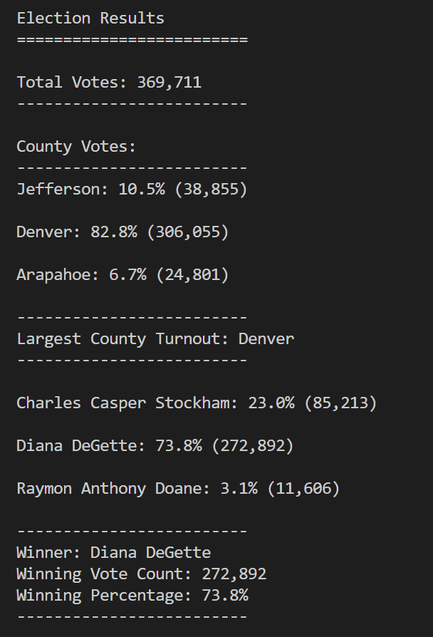

# Election Analysis

## Overview of Election Audit

Was requested an audit analysis of a Colorado congressional election. We looked at county-level turnout, votes cast for each candidate, and to determine the winner of the election.

We provided the following results, based on the data provided.

## Election-Audit Results

- The total count of votes was 369,711 (100%)
- 306,055 (82.8%)total votes in Denver, 38,855 (10.5%) in Jefferson, 24801 (6.7%) in Arapahoe county. 
- Denver had the largest number of votes.  
- Candidates recieved the following vote counts:
  - Charles Casper Stockham: 23.0% (85,213).
  - Diana DeGette: 73.8% (272,892).
  - Raymon Anthony Doane: 3.1% (11,606)
- Diana DeGette won this election by popular vote, with 272,892 votes cast for her, equaling 73.8% of all votes.

## Election-Audit Summary

The code used to read the data and output results automatically pulls the candidate names, county names, and vote totals from the data itself. If used the same CSV formatting and filename (election_results.csv), it could easily be re-used on many other data sets.

### Suggested Modifications for Future Elections Analysis
In order to provide a better audit, we could implement the following features:

- Use the elector's database to compare the number of valid, invalid, and blank votes, with the number of registered electors at a particular county. In other words, the number of valid votes added to blank, and invalid votes should be equal to the number of registered electors.

- We could also add in additional variables if we wanted to simultaneously look at more than one item per ballot. For instance, if we wanted to look at how these votes went for Governor and Lieutenant Governor, we could pull that data in, then repeat existing code, with new variables, to also output results for this additional election.

